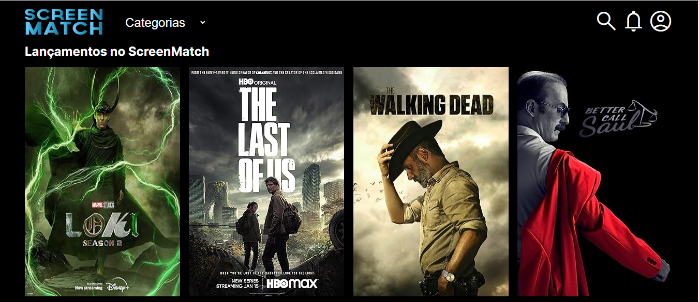
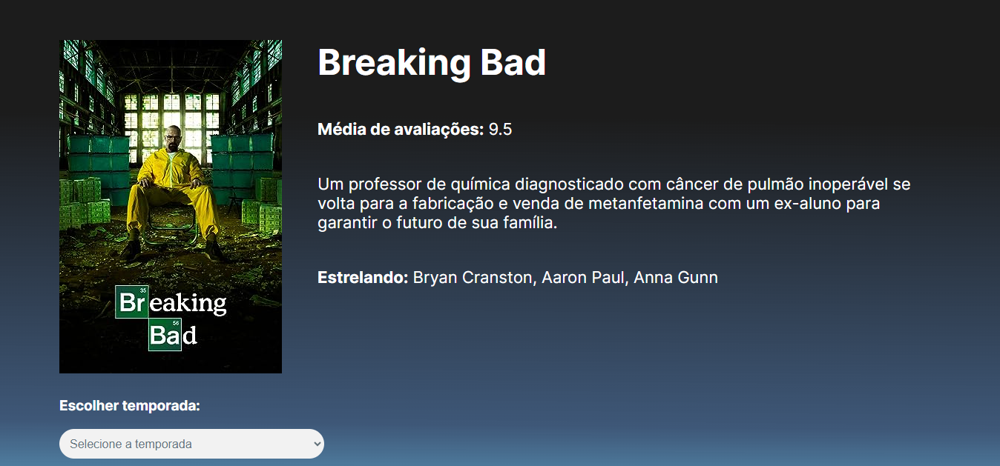

# ScreenMatch
Projeto realizado durante a formação Java Web da Alura, com a proposta de criar uma aplicação web utilizando o Spring Boot e consumindo as APIs do OMDB e ChatGPT, para extrair e tratar dados de séries e depois exibir no front end.

### Página do ScreenMatch

Front-End disponibilizado pela instrutora  
<a href="https://github.com/alura-cursos/3356-java-web-front">Layout</a>

## 🔨 Funcionalidades do projeto
1. Obter Todas as Séries
   Endpoint: /series/todas

Descrição: Retorna todas as séries cadastradas na plataforma.

2. Obter Top 5 Séries
   Endpoint: /series/top5

Descrição: Retorna as top 5 séries com base na avaliação.

3. Obter Lançamentos Mais Recentes
   Endpoint: /series/lancamentos

Descrição: Retorna as séries mais recentemente lançadas.

4. Obter Detalhes de uma Série por ID
   Endpoint: /series/{id}

Descrição: Retorna os detalhes de uma série específica com base no ID.

5. Obter Todas as Temporadas de uma Série
   Endpoint: /series/{id}/temporadas

Descrição: Retorna todos os episódios de todas as temporadas de uma série específica.

6. Obter Episódios de uma Temporada Específica
   Endpoint: /series/{id}/temporadas/{numero}

Descrição: Retorna os episódios de uma temporada específica de uma série.

7. Obter Séries por Categoria
   Endpoint: /series/categoria/{nomeGenero}

Descrição: Retorna as séries com base na categoria (gênero) especificada.

8. Obter Top Episódios de uma Série
   Endpoint: /series/{id}/topEpisodios

Descrição: Retorna os top episódios de uma série com base na avaliação.

## ✔️ Técnicas e tecnologias utilizadas
* Java
* Spring Boot
* PostgreSQL
* Spring Data JPA
* Spring Web
* Jackson

### APIs 
* <a href="https://www.omdbapi.com">OMDB</a>
* <a href="https://platform.openai.com/overview">OpenAI API (ChatGPT)</a>

## 🤝 Contribuições
* Contribuições são bem-vindas! Sinta-se à vontade para abrir problemas, propor melhorias ou enviar solicitações de pull.

⭐️ Star o projeto

🐛 Encontrar e relatar issues